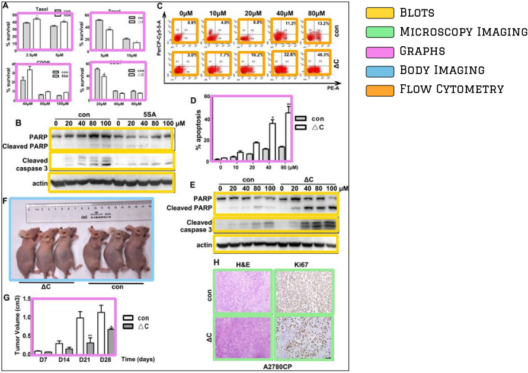

# Unveiling Scientific Articles from Paper Mills with Provenance Analysis

This repository offers a promising solution to identifying fraudulent manuscripts and could be a valuable tool for supporting scientific integrity. Its code was developed to identify suspect paper mill cases.

## Provenance Analysis


Provenance analysis provides a solution to track possible reused and manipulated data.
We tested the herein solution in the [Stock Photo Paper Mill](https://scienceintegritydigest.com/2020/07/05/the-stock-photo-paper-mill/) (SPP) and two extended versions of it (SPP-v1) and (SPP-v2).

|       Dataset         | #Documents | #Figures | #Panels  |
|-----------------------|------------|----------|----------|
|        SPP            |    121     |   498    |  2581    |
| Extended SPP (v1)     |   1090     |  1467    | 10143    |
| Extended SPP (v2)     |   4725     |  5303    | 47540    |


Code and instructions for using our method are released at [provenance](https://github.com/phillipecardenuto/upm/tree/main/provenance) directory.

## Panel Extractor



Panel extraction is essential to focus on the image regions of interest to the scientific integrity problem and filter out those that might raise false alarms due to their intrinsic similarity (e.g., diagrams, drawings, and legend indicative letters).
We collected and annotated 3,836 biomedical scientific figures under Creative Commons license from different journals, creating a dataset of 3,236 figures (32,507 panels) for training the detector of panels and 600 figures (4,888 panels) for testing it.

| Class            | Images | Labels |     P   |     R   | mAP@.5  | mAP@.5:.95: |
|------------------|--------|--------|---------|---------|---------|-------------|
| all              |   600  |  4888  |  0.941  |  0.935  |  0.95   |    0.901    |
| Blots            |   600  |   804  |  0.998  |  0.989  |  0.995  |    0.871    |
| Graphs           |   600  |  1618  |  0.968  |  0.947  |  0.98   |    0.944    |
| Microscopy       |   600  |  1838  |  0.955  |  0.934  |  0.941  |    0.922    |
| Body Imaging     |   600  |   379  |  0.833  |  0.828  |  0.859  |    0.814    |
| Flow Cytometry   |   600  |   249  |  0.948  |  0.976  |  0.973  |    0.953    |

The [Panel Extractor README](panel-extractor/README.md) provides instructions to reproduce our 
results and to download the dataset.


# Disclaimer
> Though the inhere tool can pinpoint to suspect systematically produced images and documents, its findings cannot be interpreted without the expertise of scientific integrity analysts.
> If by any chance you find any suspicious case, please report it to local integrity organizations.


# Cite this Work

Cardenuto JP, Moreira D, Rocha A (2024) Unveiling scientific articles from paper mills with provenance analysis. PLoS ONE 19(10): e0312666. https://doi.org/10.1371/journal.pone.0312666
```
@article{cardenuto2024unveiling,
    doi = {10.1371/journal.pone.0312666},
    author = {Cardenuto, João Phillipe AND Moreira, Daniel AND Rocha, Anderson},
    journal = {PLOS ONE},
    publisher = {Public Library of Science},
    title = {Unveiling scientific articles from paper mills with provenance analysis},
    year = {2024},
    month = {10},
    volume = {19},
    url = {https://doi.org/10.1371/journal.pone.0312666},
    pages = {1-28},
    number = {10},
}
```
