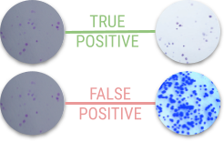
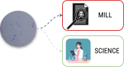
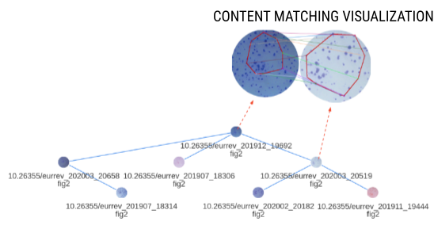

# Unveiling Paper mills with image provenance 

This repository implements a provenance analysis method dedicated to track reused and 
manipulated images from scientific article.


Disclaimer
> Thought the inhere tool can pinpoint to suspect systematic produced images and documents, its findings cannot be interpreted without the expertise of scientific integrity analysts.
> If by any chance do you find any suspicious case, please, report it to local integrity organizations.

## Datasets
The tool was evaluated in a suspect collection of articles reported by Dr. Bik and 
other investigators named [The Stock Photo Paper Mill](https://scienceintegritydigest.com/2020/07/05/the-stock-photo-paper-mill/).

To mimic a realistic case, in which thousand of suspicious articles would be included in the data stack, but few would be problematic, we created two other versions of the stock photo paper mill, adding articles with no reported problematic images.

The first extended version named `SPP extended v1` adds 969 scientific figures that contains
7,562 figure panels (e.g., a microscopy image analyzed by the scientific figure).

The second extended version named `SPP extended v2` adds 3,836 scientific figures to
the SPP extended v1, which includes more 37,397 panels.

We organized all images that we use for evaluation at [spp-dataset.zip](https://drive.google.com/file/d/1gSY2z8GLlKZ1K0UnqJgZxnsUBLLueZi0/).
After unzipping this file, we should encounter the following structure:

```bash
.
├── dataset
│   ├── annotated_panels 
│   ├── extracted_panels
│   └── spm
├── spm
│   ├── <class>-dataset.json
│   └─── <class>-evidence-db.json
├── spm-v1
│   ├── <class>-dataset.json
│   └─── <class>-evidence-db.json
└─── spm-v2
   ├── <class>-dataset.json
   └── <class>-evidence-db.json
```

Within `'dataset'` directory, you should find the annotated panels (from the panel extraction dataset),
the panels that were automatically extracted (extra panels), and the stock photo paper mill panels.
For each one of these directory, we also included a README.md file, and a spreadsheet containing 
the metadata of each image. These metadata contains the publisher, caption, class, article public URL, and figure public URL.

Within `'spm', 'spm-v1', and 'spm-v2'`, we include a JSON file that organizes the images from each dataset version (`<class>`-dataset.json).

The proposed provenance solution uses a deep-neural network description of each 
image for finding traces of manipulation/reuse. These descriptions are organized in the
`<class>`-evidence-db.json file found at `'spm', 'spm-v1', and 'spm-v2'`.
To generate these files, we use the script [create-evidence-db.py](ours/create-evidence-db.py).

## Quick Run
### Installation
1. Create a Python 3.8+ virtual environment using Conda.
2. Install [cyvlfeat](https://github.com/menpo/cyvlfeat) via Conda:
```bash
conda install -c conda-forge cyvlfeat
```
3. Install the modules from requirements.txt :
```bash
$ pip install -r requirements.txt
```
### Provenance Analysis

Before proceeding with the provenance analysis, ensure the following:

Figures are categorized into 'Microscopy,' 'Blots,' 'Body-Imagery,' 'Flow-Cytometry,' and 'Graphs.'

An evidence database has been created for each <class>.

To run the provenance analysis script, execute:

```bash
$ python run_provenance.py --dataset <path-to-evidence-database.json> 
```

For generating provenance graphs, use the optional `--visualize=True` flag:

```bash
$ python run_provenance.py --dataset <path-to-evidence-database.json> \
                           --visualize=True
```


#### Output
The script generates output stored in two directories:

1. `graphs/`: This directory holds groups of panels and documents that the method identifies as sharing common elements. If you enable the visualize flag (set it to True), you'll also find provenance graphs for each level saved as *.html files.

2. `results/`: Here, you'll find a panel-level provenance matrix that reveals which panels share content. The panel indices in the matrix correspond to the panel indices in the evidence database.

#### Evaluation
1. To review the results, refer to the method-specific Jupyter notebooks, which provide explanations for each method.
[Ours Notebook]
[BSRD Notebook]
[SILA Notebook]


2. To evaluate results for a specific dataset, execute the following script. Please, update the dataset names within the script before running it:

```bash
$ python eval.py 
```


## Results

**CONTENT PAIRING RESULT TABLE (EDGE OVERLAP)**\
Evaluates if a method could accurately find duplication across panels.
<div>


| Dataset     | #Distractors | BSRD | SILA | Proposed |
|-------------|--------------|-------|--------|----------|
| SPP          | 0            | 0.54  | 0.72   | **0.74**     |
| Ext SPP-V1  | ~8,000       | 0.25  | 0.66   | **0.74**     |
| Ext SPP-V2  | ~45,000      | 0.04  | 0.36   | **0.71**     |

</div>

**CONTENT GROUPING RESULT TABLE (NODE OVERLAP)**\
Evaluates if a method could accurately find nodes withing a group of shared content panels.

<div>


| Dataset     | #Distractors | BSRD | SILA | Proposed |
|-------------|--------------|-------|--------|----------|
| SPP           | 0            | 0.81  | 0.81   | **0.84**     |
| Ext SPP-V1  | ~8,000       | 0.24  | 0.74   | **0.84** |
| Ext SPP-V2  | ~45,000      | 0.02  | 0.42   | **0.80**     |
</div>

**CONTENT CLASSIFICATION RESULT TABLE (F1-SCORE CLASSIFICATION)**\
Evaluates if a method could accurately point to mill's panels.

<div>


| Dataset     | #Distractors | BSRD | SILA | Proposed |
|-------------|--------------|-------|--------|----------|
| SPP           | 0            | 0.87  | 0.80   | **0.91**     |
| Ext SPP-V1  | ~8,000       | 0.44  | 0.77   | **0.91**     |
| Ext SPP-V2  | ~45,000      | 0.08  | 0.44   | **0.84**     |

</div>

### Provenance Graph Visualization

Graph visualization of one of the graph output.\



```
                                   UNICAMP (University of Campinas) Recod.ai
```